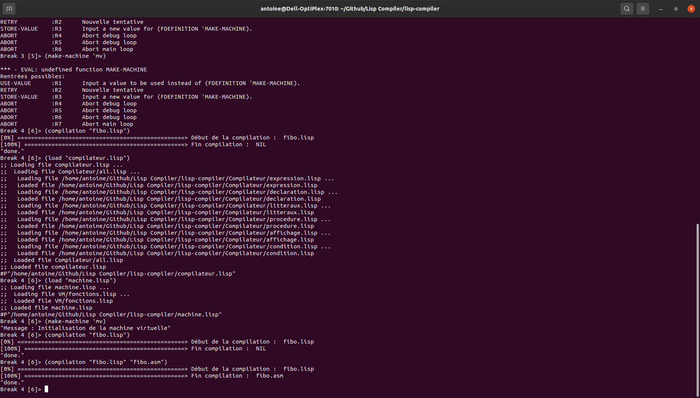
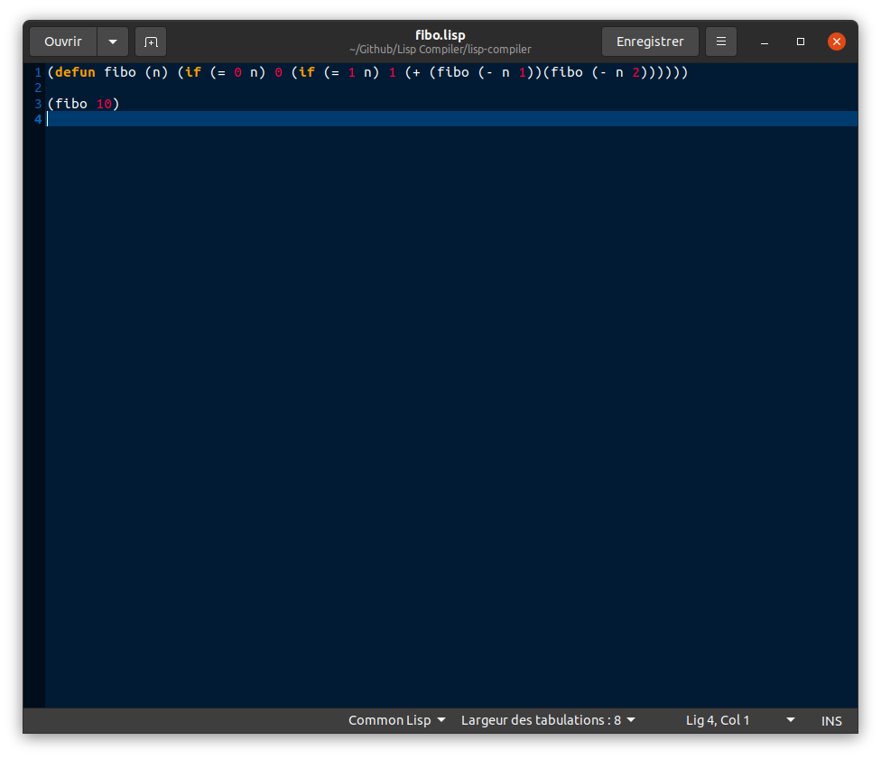
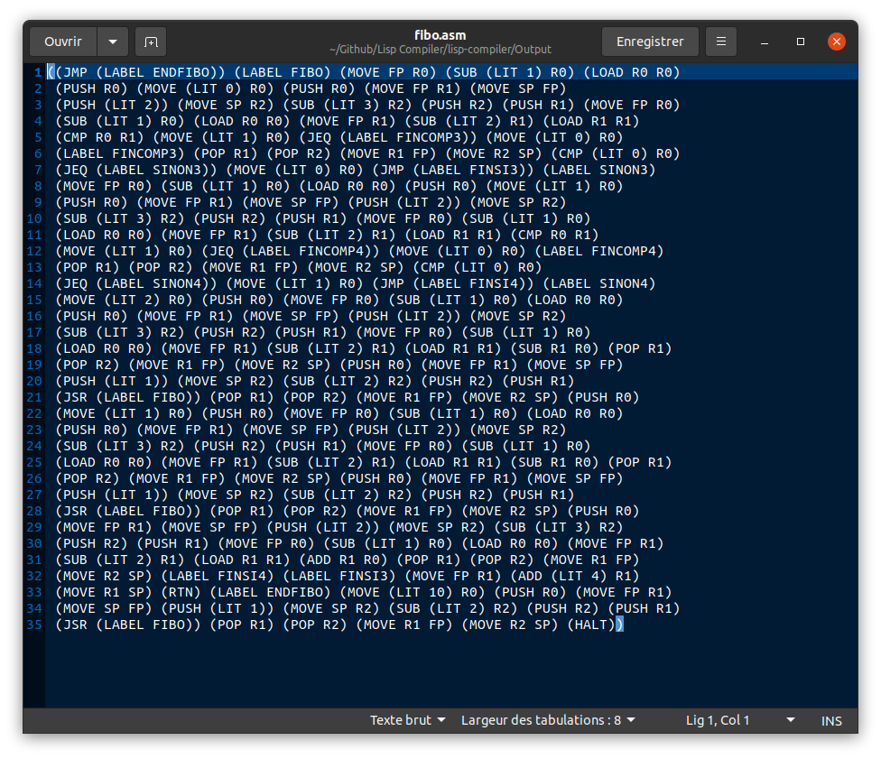
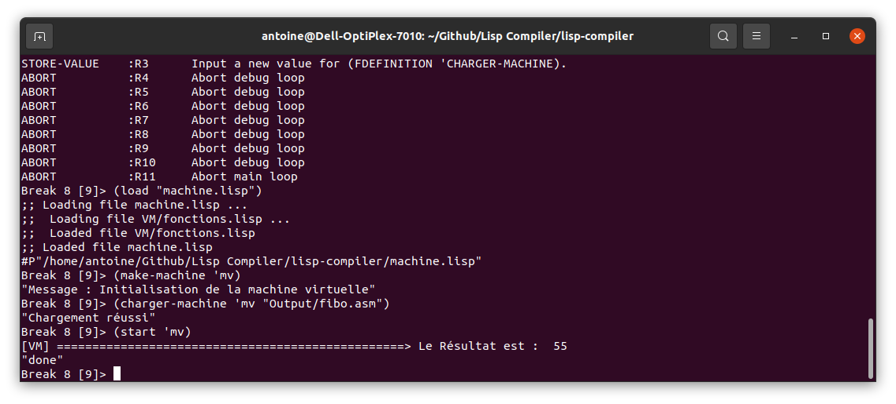

# Machine virtuelle & compiltateur en Lisp

## Screenshots

  
  
   
   

## Description
L'objectif du projet est de réaliser un compilateur qui prend en entrée une expression lisp et fournit en sortie le fichier équivalent en asm. Il faut également réaliser une machine virtuelle qui va interpréter le fichier asm généré par le compilateur et interpréter le code asm pour enfin fournir un résultat.

## Utilisation compilateur

> (load "compilateur.lisp")
> (compilation "Input.lisp" "nomFichierEnSortie.asm") ;; ex : (compilation "fibo.lisp" "fibo1.asm")

ou Input.lisp est un fichier contenant une expression Lisp (ex: fibo.lisp)
et nomFichierEnSortie.asm contient le code ASM issu de cette expression

Le fichier ASM généré à partir du fichier LISP est présent dans le dossier /Output.

## Utilisation machine virtuelle

> (load "machine.lisp")
> (make-machine 'mv)

ou mv est le nom de la machine virtuelle

> (charger-machine 'mv "cheminVersLeFichierASM") ;; ex : (charger-machine 'mv "Output/fibo1.asm")

pour charger le fichier ASM dans la machine virtuelle.

> (start 'mv)

permet de lancer la machine virtuelle et d'obtenir le résultat.

## Des fichiers tests ont été créé pour simplifier l'utilisation :

Un fichier "test1.lisp" a été préparé. 
Ce fichier calcul le résultat de fibo(10).

Pour l'utiliser, il suffit simplement de :

> (load "test1.lisp") ;; pour charger le compilateur et la vm, créer la vm, charger le fichier asm dans la vm... automatiquement
> (start 'mv)	    ;; pour obtenir le résultat

Un fichier "test2.lisp" a également été préparé.
Ce fichier calcul le résultat de fact(6).

